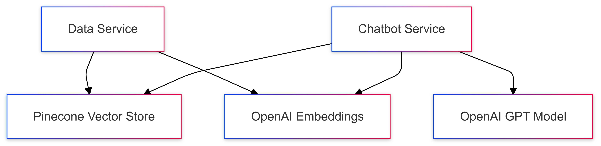

# GetXM - Document Question Answering System

A robust document question-answering system built with FastAPI, LangChain, OpenAI, and Pinecone. This system allows users to process documents and ask questions about their content using natural language.

## Architecture Overview

The system consists of two main microservices:
1. **Data Service (Port 8000)**: Handles document processing and vector storage.
2. **Chatbot Service (Port 8001)**: Manages question-answering interactions.

### System Components



## Setup and Configuration

### Prerequisites
- Python 3.10 or higher
- Poetry (for dependency management)
- OpenAI API key
- Pinecone API key

### Environment Variables
Create a `.env` file with the following configurations:
```env
OPENAI_API_KEY=your_openai_api_key
PINECONE_API_KEY=your_pinecone_api_key
PINECONE_INDEX_NAME=default_index_name
```

### Installation Steps

1. **Ensure Python 3.10 is Installed**
   - The project requires Python 3.10. You can download it from the [official Python website](https://www.python.org/downloads/release/python-3100/).
   - Verify the installation:
     ```bash
     python3.10 --version
     ```

2. **Install Poetry**
   ```bash
   # macOS/Linux
   curl -sSL https://install.python-poetry.org | python3 -
   ```

3. **Clone the Repository**
   ```bash
   git clone <repository-url>
   cd getxm
   ```

4. **Install Dependencies**
   ```bash
   poetry install
   ```

5. **Run the Services**
   - **Data Service**:
     ```bash
     uvicorn src.services.data_service:app --reload --host 0.0.0.0 --port 8000
     ```
   - **Chatbot Service**:
     ```bash
     uvicorn src.services.chatbot_service:app --reload --host 0.0.0.0 --port 8001
     ```

6. **Run the Streamlit UI**
   ```bash
   streamlit run src/ui/ui.py
   ```

## Usage

### Data Processing
- Use the Streamlit UI or send a POST request to the data service to process documents.

### Question Answering
- Use the Streamlit UI or send a POST request to the chatbot service to ask questions about the processed documents.

### Example Request
```bash
curl -X POST http://localhost:8001/chat \
  -H "Content-Type: application/json" \
  -d '{
    "question": "What are the main topics discussed?",
    "index_name": "my-index"
  }'
```

## Deployment

### Serverless Deployment
- The project can be deployed using serverless platforms like AWS Lambda. Refer to [serverless.yml](serverless.yml) for configuration details.

## Contributing
Feel free to open issues or submit pull requests for improvements.

## License
This project is licensed under the MIT License.