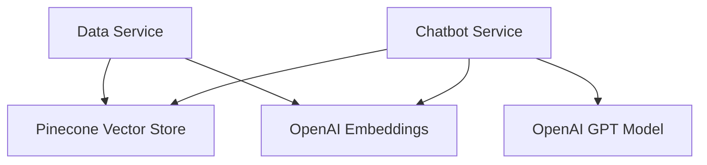

# GetXM - Document Question Answering System

A robust document question-answering system built with FastAPI, LangChain, OpenAI, and Pinecone. This system allows users to process documents and ask questions about their content using natural language.

## Architecture Overview

The system consists of two main microservices:
1. Data Service (Port 8000): Handles document processing and vector storage
2. Chatbot Service (Port 8001): Manages question-answering interactions

### System Components



## Setup and Configuration

### Prerequisites
- Python 3.10 or higher
- Poetry (dependency management)
- OpenAI API key
- Pinecone API key

### Environment Variables
Create a `.env` file with the following configurations:
```env
OPENAI_API_KEY=your_openai_api_key
PINECONE_API_KEY=your_pinecone_api_key
PINECONE_INDEX_NAME=default_index_name
```

### Detailed Installation Steps

1. **Install Python 3.10+**
   ```bash
   # Check Python version
   python --version
   ```

2. **Install Poetry**
   ```bash
   # macOS/Linux
   curl -sSL https://install.python-poetry.org | python3 -

   # Windows PowerShell
   (Invoke-WebRequest -Uri https://install.python-poetry.org -UseBasicParsing).Content | python -
   ```

3. **Clone the Repository**
   ```bash
   git clone <repository-url>
   cd getxm
   ```

4. **Install Dependencies**
   ```bash
   # Install all dependencies using Poetry
   poetry install
   
   # Activate the virtual environment
   poetry shell
   ```

5. **Install Additional Dependencies**
   The project requires the following key packages:
   - LangChain and Extensions:
     ```bash
     poetry add langchain==^0.3.13 langchain-community==^0.3.13 langchain-openai==^0.2.14
     ```
   - Vector Store:
     ```bash
     poetry add faiss-cpu==^1.9.0.post1
     ```
   - FastAPI and Server:
     ```bash
     poetry add fastapi==^0.115.6 uvicorn==^0.34.0 python-multipart==^0.0.20
     ```
   - Utility Packages:
     ```bash
     poetry add python-dotenv==^1.0.1 numpy==^2.2.1 pandas==^2.2.3
     ```

6. **Verify Installation**
   ```bash
   # Check installed packages
   poetry show

   # Start the services
   # In terminal 1
   uvicorn data_service:app --reload --port 8000

   # In terminal 2
   uvicorn chatbot_service:app --reload --port 8001
   ```

### Running the Services

1. **Start Data Service**
   ```bash
   uvicorn data_service:app --reload --port 8000
   ```
   The service will be available at `http://localhost:8000`

2. **Start Chatbot Service**
   ```bash
   uvicorn chatbot_service:app --reload --port 8001
   ```
   The service will be available at `http://localhost:8001`

3. **Verify Services**
   ```bash
   # Check Data Service
   curl http://localhost:8000/docs

   # Check Chatbot Service
   curl http://localhost:8001/docs
   ```

### Troubleshooting Installation

Common installation issues and solutions:

1. **Poetry Installation Fails**
   ```bash
   # Alternative installation method
   pip install poetry
   ```

2. **Dependency Conflicts**
   ```bash
   # Clear poetry cache
   poetry cache clear . --all
   
   # Update dependencies
   poetry update
   ```

3. **Python Version Mismatch**
   ```bash
   # Create a .python-version file
   echo "3.10" > .python-version
   
   # Recreate virtual environment
   poetry env remove python
   poetry install
   ```

4. **Package Installation Issues**
   ```bash
   # Install packages individually
   poetry add package-name@^version
   
   # If still failing, try with pip within poetry shell
   poetry shell
   pip install package-name==version
   ```

## Core Components

### 1. Data Service (`data_service.py`)
Handles document processing and storage:
- Chunks documents into manageable segments
- Generates embeddings using OpenAI
- Stores vectors in Pinecone
- Provides REST API for document processing

Key endpoints:
```http
POST /process
{
    "file_path": "/path/to/document",
    "index_name": "custom-index",
    "chunk_size": 1000,
    "chunk_overlap": 200
}
```

### 2. Chatbot Service (`chatbot_service.py`)
Manages the question-answering system:
- Integrates with OpenAI's GPT model
- Retrieves relevant context from Pinecone
- Generates accurate answers based on document content

Key endpoints:
```http
POST /chat
{
    "question": "What does the document say about X?",
    "index_name": "custom-index"
}
```

### 3. Pinecone Utils (`pinecone_utils.py`)
Shared utilities for Pinecone operations:
- Index management
- Dimension handling
- Error handling and logging

## Key Features

1. **Dynamic Index Management**
   - Create and manage multiple document indexes
   - Automatic index creation with proper dimensionality
   - Region-specific deployment (us-east-1)

2. **Robust Error Handling**
   - Comprehensive logging system
   - Graceful error recovery
   - Detailed error messages

3. **Efficient Document Processing**
   - Intelligent text chunking
   - Overlap for context preservation
   - Asynchronous operations

4. **Smart Question Answering**
   - Context-aware responses
   - Source document reference
   - Natural language understanding

## Usage Examples

1. **Processing a Document**
```bash
curl -X POST http://localhost:8000/process \
  -H "Content-Type: application/json" \
  -d '{
    "file_path": "/path/to/document.txt",
    "index_name": "my-index",
    "chunk_size": 1000,
    "chunk_overlap": 200
  }'
```

2. **Asking Questions**
```bash
curl -X POST http://localhost:8001/chat \
  -H "Content-Type: application/json" \
  -d '{
    "question": "What are the main topics discussed?",
    "index_name": "my-index"
  }'
```

## Best Practices

1. **Document Processing**
   - Use appropriate chunk sizes (1000-2000 characters)
   - Maintain reasonable overlap (100-200 characters)
   - Process related documents in the same index

2. **Question Asking**
   - Be specific in questions
   - Use clear, natural language
   - Reference specific topics when possible

## Error Handling

Common error scenarios and solutions:
1. Index Creation Failures
   - Verify Pinecone API key
   - Check region availability
   - Confirm dimension settings

2. Document Processing Errors
   - Validate file paths
   - Check file permissions
   - Verify file format

3. Query Errors
   - Ensure index exists
   - Verify index name
   - Check API key permissions

## Logging

The system uses a hierarchical logging system:
- INFO: General operation information
- DEBUG: Detailed debugging information
- ERROR: Error conditions and exceptions

Log files:
- `debug.log`: Chatbot service logs
- `data_service_debug.log`: Data service logs

## Security Considerations

1. API Key Management
   - Store keys in .env file
   - Never commit keys to version control
   - Rotate keys periodically

2. Access Control
   - Implement rate limiting
   - Add authentication as needed
   - Monitor usage patterns

## Future Enhancements

Potential improvements:
1. Multi-document support
2. Real-time processing updates
3. Advanced query capabilities
4. User authentication
5. Rate limiting
6. Caching layer

## Troubleshooting

Common issues and solutions:
1. Connection errors: Check API keys and network
2. Index errors: Verify index name and region
3. Processing errors: Validate file formats and paths